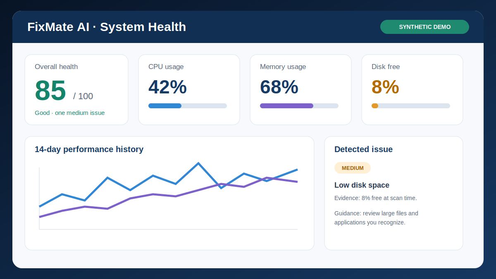
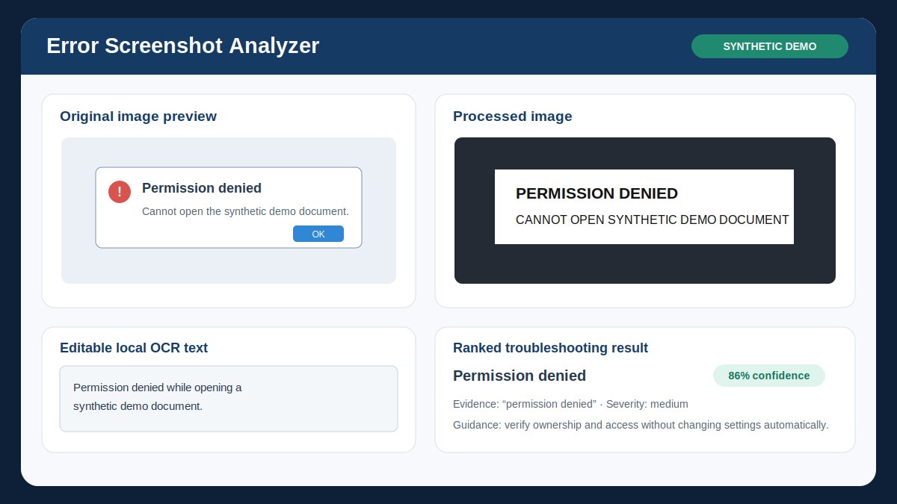
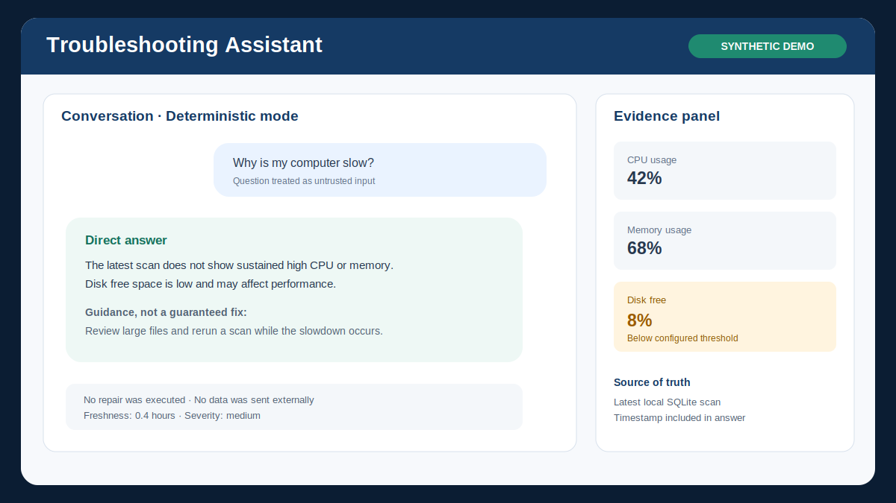
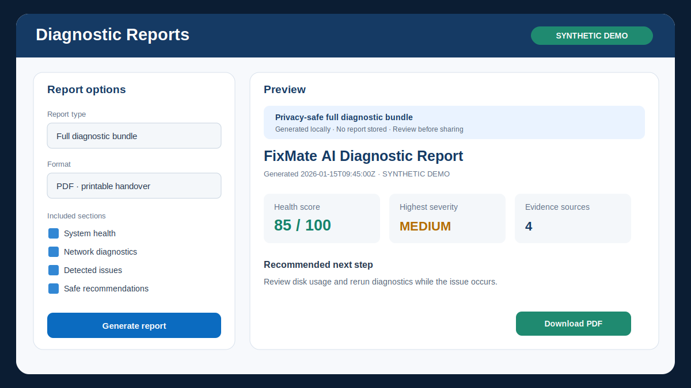
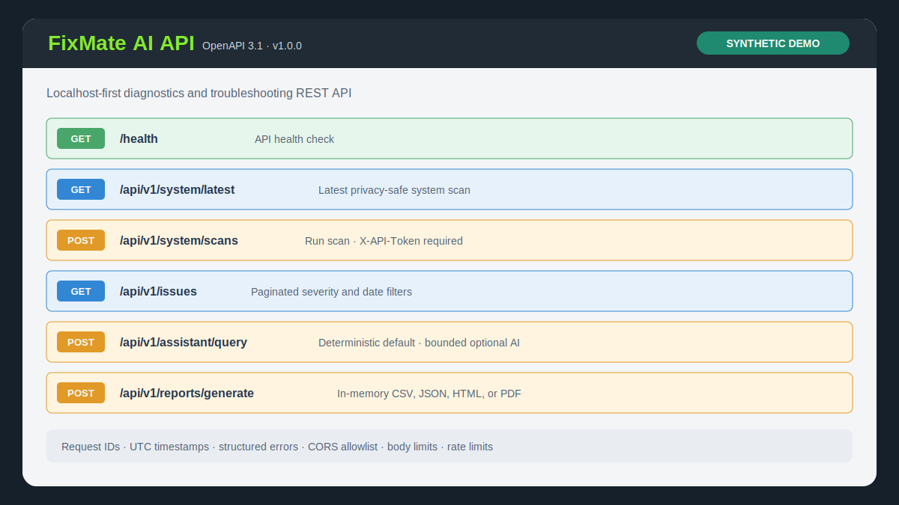
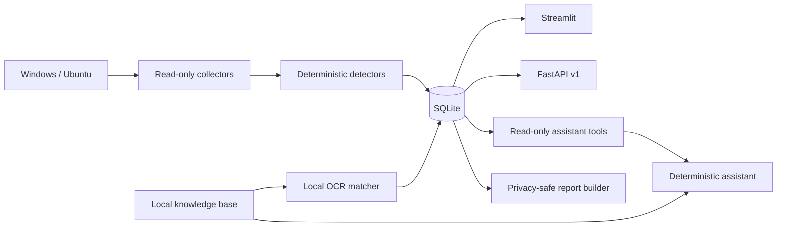

# FixMate AI

### Local-first system diagnostics, evidence-based troubleshooting, and privacy-safe support reports for Windows and Ubuntu

[](https://www.python.org/)
[](https://streamlit.io/)
[](https://fastapi.tiangolo.com/)
[](docs/DOCKER.md)
[](.github/workflows/ci.yml)
[](tests/)

FixMate AI is a portfolio-scale IT support application that collects system and network evidence, detects explicit problems, stores local history, analyzes error screenshots with local OCR, answers supported troubleshooting questions, and exports professional diagnostic reports.

The project is deliberately **read-only**. It does not require administrator/root privileges, execute repairs, terminate processes, change settings, scan ports, capture packets, inspect browsing history, or read personal file contents. Deterministic evidence remains authoritative; optional AI can add a labeled explanation but cannot replace facts or access unrestricted tools.

> The images below are editable vector mockups using **SYNTHETIC DEMO** data. They contain no real device or personal information.

## Portfolio highlights

- One typed service layer reused by Streamlit and a versioned FastAPI backend
- Cross-platform collection through `psutil`, Python standard-library APIs, and `pathlib`
- Additive SQLite migrations that preserve existing records
- Local Pillow/OpenCV/Tesseract screenshot pipeline with deterministic knowledge-base matching
- Evidence-grounded assistant with explicit intent routing and read-only tools
- Optional consent-gated cloud or loopback Ollama-compatible explanation provider
- In-memory CSV, JSON, HTML, and PDF diagnostic reports
- Localhost-first API security, token-protected POST routes, request limits, and rate limits
- Non-root Docker Compose deployment with a shared SQLite volume
- Offline-safe automated tests on Windows and Ubuntu with Python 3.11 and 3.12
- Deterministic synthetic demo generator with overwrite protection

## Feature progression

| Phase | Delivered capability |
|---|---|
| 1 | CPU, memory, disk, OS, boot time, top processes, health score, issue rules, SQLite history, Plotly dashboard |
| 2 | Active interfaces, traffic counters, bounded connectivity/latency checks, network issues and history |
| 3 | Validated image upload, OpenCV preprocessing, optional local Tesseract OCR, curated error matching |
| 4 | Deterministic natural-language troubleshooting over collected local evidence |
| 5 | Optional bounded LLM explanation with consent, redaction, allowlisted tools, and deterministic fallback |
| 6 | Versioned FastAPI backend with schemas, pagination, filters, request IDs, auth, CORS, and rate limits |
| 7 | Privacy-safe system, network, screenshot, assistant, and full reports in CSV/JSON/HTML/PDF |
| 8 | Python slim Docker image, separate Compose services, shared volume, Windows/Ubuntu CI matrix |
| 9 | Safe synthetic demo tooling, vector assets, architecture/security docs, and interview package |

## Screenshots

### System health dashboard



### Error Screenshot Analyzer



### Troubleshooting Assistant



### Diagnostic reports



### FastAPI and Swagger



See the [demo guide](docs/DEMO.md) for safe screenshot capture instructions.

## Architecture



Collection, detection, persistence, assistant routing, provider integration, reporting, and presentation are independent modules. Detailed data, privacy, API, assistant, database, and Docker diagrams are in [ARCHITECTURE.md](docs/ARCHITECTURE.md).

## Technology stack

| Area | Technology | Purpose |
|---|---|---|
| Runtime | Python 3.11+ | Cross-platform application and tooling |
| UI | Streamlit | Interactive dashboards and troubleshooting pages |
| API | FastAPI, Pydantic, Uvicorn | Versioned local REST API and OpenAPI documentation |
| Metrics | psutil | CPU, memory, disk, process, and network counters |
| Analytics | Pandas, Plotly | History tables and interactive charts |
| Vision/OCR | Pillow, OpenCV, pytesseract | Validation, preprocessing, and optional local OCR |
| Persistence | SQLite (`sqlite3`) | Local scans, issues, network, and screenshot metadata |
| Reports | ReportLab, PyPDF | In-memory PDF generation and validation |
| Testing | pytest, FastAPI TestClient, Streamlit AppTest | Unit, integration, API, privacy, and UI validation |
| Deployment | Docker, Docker Compose | Reproducible non-root local services |
| CI | GitHub Actions | Windows/Ubuntu and Python 3.11/3.12 matrix |

## Quick start without Docker

Native execution is the recommended mode for diagnosing the actual computer. Docker diagnostics describe containers rather than the host.

### Windows PowerShell

```powershell
git clone <your-repository-url>
cd fixmate-ai
py -3.11 -m venv .venv
.\.venv\Scripts\Activate.ps1
python -m pip install --upgrade pip
python -m pip install -r requirements.txt
python -m streamlit run app.py
```

If PowerShell blocks activation, use an appropriate local execution policy or call `.\.venv\Scripts\python.exe` directly. FixMate AI itself does not require administrator privileges.

### Ubuntu

```bash
git clone <your-repository-url>
cd fixmate-ai
python3.11 -m venv .venv
source .venv/bin/activate
python -m pip install --upgrade pip
python -m pip install -r requirements.txt
python -m streamlit run app.py
```

Open `http://127.0.0.1:8501`.

## Optional local Tesseract OCR

The application starts without Tesseract. Users can enter error text manually.

Windows: install a trusted current Tesseract build, add it to `PATH`, or set:

```powershell
$env:TESSERACT_CMD="C:\Program Files\Tesseract-OCR\tesseract.exe"
tesseract --version
```

Ubuntu:

```bash
sudo apt update
sudo apt install tesseract-ocr
tesseract --version
```

Restart Streamlit after changing Tesseract configuration.

## FastAPI

Start the API separately. Native execution binds to `127.0.0.1:8000` by default.

PowerShell:

```powershell
$env:FIXMATE_API_TOKEN = Read-Host "Enter a private local API token"
python -m api.main
```

Ubuntu:

```bash
export FIXMATE_API_TOKEN="replace-with-a-private-local-token"
python -m api.main
```

- Health: `http://127.0.0.1:8000/health`
- Status: `http://127.0.0.1:8000/api/v1/status`
- Swagger: `http://127.0.0.1:8000/docs`

GET routes are read-only. Protected POST routes require `X-API-Token`; when no token is configured they return a safe 503 rather than operating without authentication. Tokens are loaded only from environment variables and compared in constant time.

Example:

```powershell
Invoke-RestMethod -Method Post `
  -Uri http://127.0.0.1:8000/api/v1/system/scans `
  -Headers @{ "X-API-Token" = $env:FIXMATE_API_TOKEN }
```

## Run with Docker

Docker is optional. Set a runtime token and start the two services:

```powershell
$env:FIXMATE_API_TOKEN = Read-Host "Enter a private local API token"
docker compose config
docker compose build
docker compose up
```

Ubuntu uses the equivalent `export FIXMATE_API_TOKEN="..."`. Compose publishes Streamlit at `127.0.0.1:8501` and FastAPI at `127.0.0.1:8000`. Both containers share the `fixmate_ai_data` volume.

```bash
docker compose logs
docker compose down
```

`docker compose down` preserves history; `docker compose down --volumes` deliberately removes the Docker-managed database. See [DOCKER.md](docs/DOCKER.md).

## Synthetic demo data

Generate a dedicated, deterministic demo database:

```bash
python scripts/generate_demo_data.py --output data/demo_fixmate.db --seed 2026 --days 14
```

Regenerate only a recognized marked demo:

```bash
python scripts/generate_demo_data.py --output data/demo_fixmate.db --seed 2026 --days 14 --reset-demo
```

The generator refuses the normal `data/fixmate.db`, refuses existing outputs by default, and never replaces an unmarked database. It uses explicit synthetic labels and reserved `.invalid` hostnames. Generated databases are ignored by Git. See [DEMO.md](docs/DEMO.md).

## Troubleshooting assistant

Supported deterministic question categories include:

- Why is my computer slow?
- What is using the most memory?
- Is my disk nearly full?
- Is my internet connection working?
- Why is my network slow?
- What problems were detected today?
- Explain my latest screenshot error.
- Summarize this computer’s health.
- What should I fix first?

Every answer contains a direct conclusion, evidence, a relevant timestamp, freshness, severity where applicable, and guidance labeled as non-guaranteed. Missing, stale, or conflicting evidence is stated explicitly.

Optional model enhancement is disabled by default. Provider configuration is documented in [.env.example](.env.example). Cloud evidence requires explicit session consent; invalid or unsafe output falls back to the deterministic answer. The application works normally without an API key, internet, Ollama, or any model.

## Diagnostic reports

The Reports page and API generate:

- System health summary
- Network diagnostics
- Screenshot-analysis metadata
- Deterministic assistant summary
- Full diagnostic bundle

Formats are CSV, JSON, standalone HTML, and PDF. Report bytes are generated in memory and not stored by default. Conversation history is excluded unless explicitly selected for one Streamlit export.

API discovery and generation:

- `GET /api/v1/reports/types`
- `POST /api/v1/reports/generate`

## Testing and CI

```bash
python -m pytest -v
```

Tests use generated images, temporary databases, and mocked OCR, network, and provider operations. They require no internet, Tesseract, Ollama, cloud service, or real API key.

[GitHub Actions CI](.github/workflows/ci.yml) runs the complete suite on:

- Ubuntu latest with Python 3.11 and 3.12
- Windows latest with Python 3.11 and 3.12

## Privacy and security

- Local processing and SQLite storage by default
- No raw screenshot persistence
- OCR text redacted before storage
- No conversation table; chat history remains in Streamlit session state
- No report persistence by default
- No password, browsing-history, document-content, packet-capture, or port-scan collection
- Localhost API default, CORS allowlist, body limits, request IDs, structured errors, and rate limits
- No shell, arbitrary SQL, filesystem, repair, process-control, or unrestricted model tools
- Secrets loaded from environment variables and excluded from Git/Docker

Read [SECURITY.md](docs/SECURITY.md) and [PRIVACY.md](docs/PRIVACY.md) before adapting the project for other users or networks.

## Known limitations

- Metrics are snapshots, not continuous monitoring.
- Connectivity tests one configured TCP target and is not a complete internet diagnosis.
- OCR accuracy depends on image quality, fonts, language, and local Tesseract.
- The curated knowledge base does not cover every Windows or Ubuntu error.
- Intent matching supports documented categories rather than arbitrary questions.
- Redaction is best-effort and reports must be reviewed before sharing.
- Optional model explanations can be inaccurate and remain secondary to deterministic evidence.
- SQLite and in-memory rate limiting target local/single-process use.
- Local API token authentication is not sufficient for public internet deployment.
- Docker measures container resources and networking, not the host.
- FixMate AI does not perform or claim autonomous repair.

## Future improvements

- First-class UI selection for marked synthetic demo databases
- Accessibility and responsive-layout improvements
- Optional PostgreSQL and shared deployment rate limiting
- Stronger team authentication, TLS deployment guidance, and audit events
- Broader knowledge-base provenance and OCR language configuration
- Docker build validation and coverage reporting in CI
- Native Windows and Ubuntu packaging

See the truthful, non-autonomous [ROADMAP.md](docs/ROADMAP.md).

## Five-minute demo script

1. State that FixMate AI is read-only and the displayed records are synthetic.
2. Show health score, metrics, history, and a threshold-generated issue.
3. Run or explain the bounded network diagnostic.
4. Use typed synthetic error text in the screenshot analyzer.
5. Ask “What should I fix first?” and point to evidence/timestamps.
6. Generate a privacy-safe PDF or HTML handover report.
7. Open Swagger and show token-protected POST routes.
8. Finish with the cross-platform test matrix and security boundaries.

The expanded walkthrough is in [DEMO.md](docs/DEMO.md).

## CV-ready bullet points

- Built a cross-platform diagnostics platform using Python, Streamlit, FastAPI, SQLite, psutil, OpenCV, Tesseract, Plotly, and ReportLab.
- Designed deterministic system/network issue detection and evidence-grounded troubleshooting with privacy-safe history and reporting.
- Implemented optional consent-gated model explanations with strict read-only tool allowlists, payload minimization, validation, and deterministic fallback.
- Delivered a versioned REST API with Pydantic schemas, token-protected POST routes, request IDs, CORS restrictions, rate limits, and isolated tests.
- Added non-root Docker Compose deployment and Windows/Ubuntu CI across Python 3.11 and 3.12.

## Interview talking points

- Why deterministic evidence is authoritative and AI is optional
- How additive migrations preserve earlier phases
- How one service layer supports both Streamlit and FastAPI
- Why screenshot/OCR text is untrusted and never executed
- How provider tools are allowlisted and bounded
- Why reports are in-memory and filenames are generated
- Why Docker is useful for deployment but not host diagnostics
- How temporary databases and mocks keep tests private and offline-safe

See [INTERVIEW_GUIDE.md](docs/INTERVIEW_GUIDE.md) for a 60-second pitch, technical explanation, challenge stories, LinkedIn draft, and common interview answers.

## Project structure

```text
fixmate-ai/
├── app.py                         # System and network Streamlit dashboard
├── pages/                         # Screenshot, assistant, and reports pages
├── src/                           # Collectors, rules, assistant, privacy, reports
├── api/                           # FastAPI routers, schemas, services, security
├── data/error_knowledge_base.json # Curated local troubleshooting knowledge
├── scripts/generate_demo_data.py  # Safe deterministic synthetic data
├── tests/                         # Offline-safe unit and integration tests
├── docs/                          # Architecture, security, demo, interview guides
├── Dockerfile
└── docker-compose.yml
```

## Documentation

- [Architecture](docs/ARCHITECTURE.md)
- [Demo guide](docs/DEMO.md)
- [Docker guide](docs/DOCKER.md)
- [Security model](docs/SECURITY.md)
- [Privacy guide](docs/PRIVACY.md)
- [Roadmap](docs/ROADMAP.md)
- [Interview guide](docs/INTERVIEW_GUIDE.md)
- [Phase plans](docs/PHASE9_PLAN.md)
