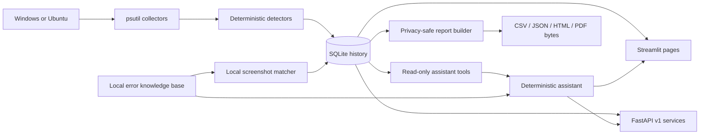
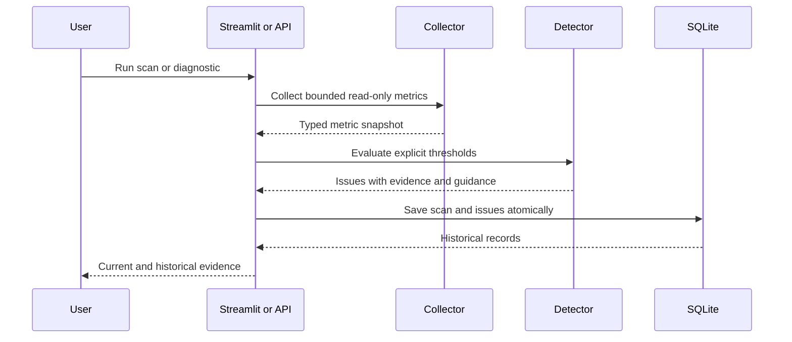
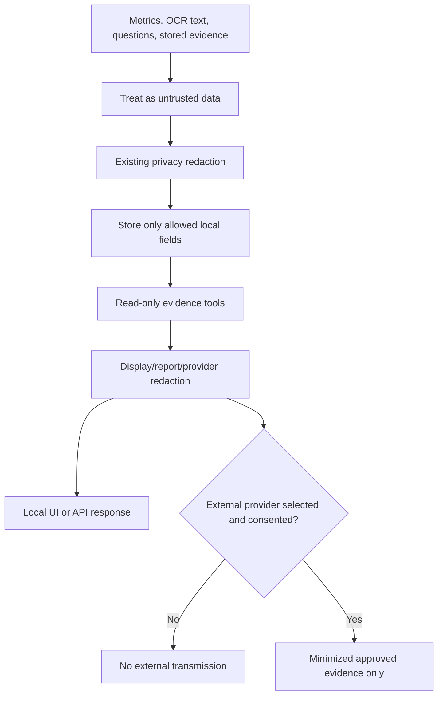
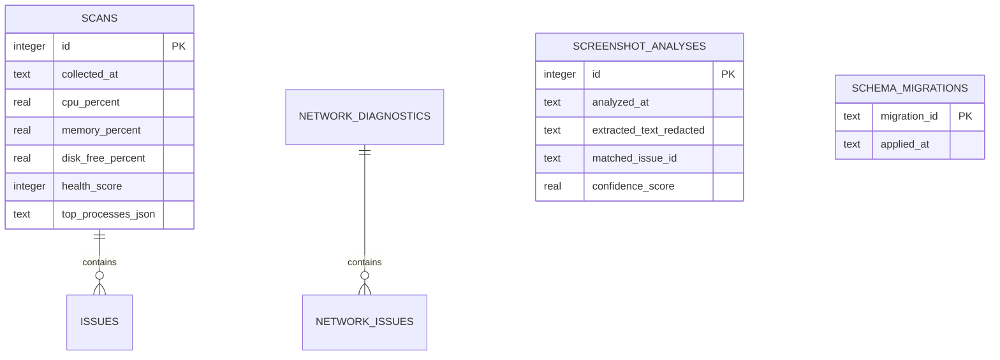
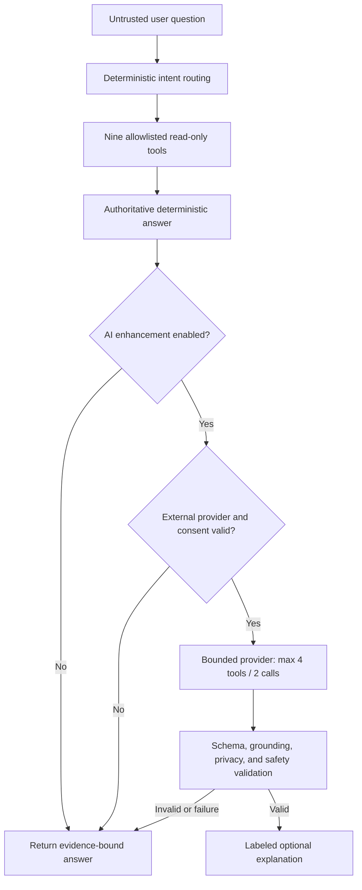
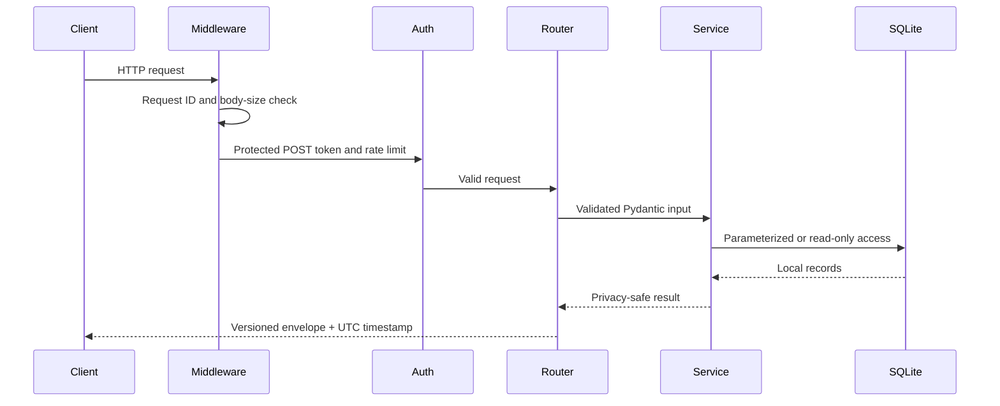
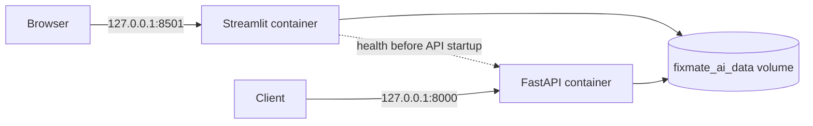

# FixMate AI Architecture

FixMate AI is a local-first, read-only diagnostic application. Collection, deterministic detection, persistence, presentation, reporting, and optional model explanation are separate so each boundary can be tested and constrained.

## High-level architecture

## Diagnostic data flow

Collectors do not require administrator privileges, inspect file contents, terminate processes, change settings, scan ports, or capture packets.

## Privacy flow

Screenshot files are processed in memory and are not stored. OCR text is redacted before persistence. Reports are generated in memory. Conversation history remains in Streamlit session state unless explicitly selected for one report.

## Streamlit and FastAPI

Streamlit and FastAPI reuse the same service modules and SQLite schema. They are separate presentation surfaces rather than separate implementations.

- Streamlit provides interactive system/network dashboards, screenshot analysis, troubleshooting chat, and report downloads.
- FastAPI exposes versioned diagnostics, history, issues, screenshot metadata, assistant queries, and reports.
- API route handlers delegate to service classes instead of duplicating collectors or detection rules.
- Native FastAPI binds to `127.0.0.1`; Docker binds internally to `0.0.0.0` but publishes only on host loopback.

## Database overview

Migrations are additive and preserve Phase 1–3 records. Assistant conversations and generated reports have no database tables.

## Assistant safety model

The model never receives database, filesystem, shell, process, repair, or unrestricted network access. It cannot replace deterministic evidence or claim a repair occurred.

## API request flow

## Docker deployment

Both services reuse one non-root Python 3.12 slim image. Container diagnostics describe container resources and networking, so native execution is required for actual host diagnostics.

